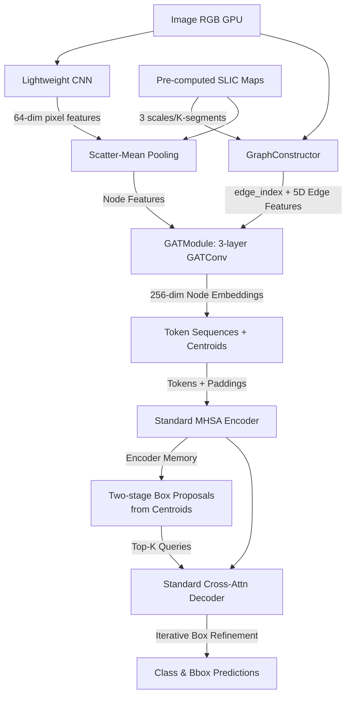

# DINO-Superpixel-Graph 

**DINO-Superpixel-Graph** is an experimental object detection model that replaces the traditional CNN backbone in [DINO](https://arxiv.org/abs/2203.03605) with a **GPU-native, learnable Graph Attention Network (GAT) backbone** built on top of superpixels. Instead of learning features through fixed dense rigid grids, DINO-Superpixel-Graph dynamically builds a region adjacency graph from superpixels, computes node/edge features, and uses Message Passing to generate optimal 256-dimensional tokens natively on the GPU, feeding them directly into a standard transformer.

> **Key Idea:** Superpixels *are* the graph nodes. A lightweight CNN extracts per-pixel features, which are scatter-mean pooled into node embeddings. A 3-layer GAT refines these representations using region adjacency and 5D edge features, replacing the need for deformable grid attention.

---

## 📐 Architecture Overview



### How It Works (Step by Step)

| Step | What Happens | Source |
|------|-------------|------|
| **1. SLIC Maps** | **Pre-computed SLIC `.npz` maps** are loaded from the dataset for 3 scales (e.g., `400, 200, 100`) to provide non-grid structural boundaries. (CPU fallback available). | Dataset |
| **2. Per-Pixel CNN** | A fresh, end-to-end trained lightweight 3-layer CNN (Conv→BN→ReLU) extracts 64D feature representations from the entire image. | `graph_backbone.py` |
| **3. Node Graph Features** | CNN pixel features are pooled via `scatter_mean` mapping to their corresponding superpixels, generating the raw learnable node features. | `graph_backbone.py` |
| **4. Edge Construction** | A region adjacency graph (`edge_index`) is built dynamically on the GPU by checking neighboring pixels in the SLIC map. | `graph_backbone.py` |
| **5. 5D Edge Features** | Edge attributes are computed: Color diff, CNN feature diff, Texture diff (Sobel), Spatial distance, and Boundary strength. | `graph_backbone.py` |
| **6. GAT Message Passing** | A 3-layer `GATConv` network with multi-head attention refines the node representations utilizing both the node features and the projected 5D edge features, producing 256-dim tokens. | `graph_backbone.py` |
| **7. Multi-Scale Output** | The backbone aggregates all tokens across scales and outputs `tokens [bs, N_total, 256]`, continuous `centroids [bs, N_total, 2]`, `padding_mask`, and `level_counts`. | `graph_backbone.py` |
| **8. Transformer IO** | The refined 256-dim tokens, alongside 2D continuous centroid positional encodings, are passed into a pure `Standard MHSA` Encoder-Decoder transformer identical to standard DINO but without structural grid rigidity. | `slic_transformer.py` |

---

## 🧠 Why Learnable Graphs Over Grids?

Standard DINO utilizes **deformable attention** applied on rigid visual spatial grids (~8,400 query grid cells). DINO-Superpixel-Graph inherently bypasses sparse sampling kernels, relying instead on pure PyTorch Geometric logic:

| Feature Dimension | Grid-based DINO | DINO-Superpixel-Graph |
|---|---|---|
| **Token count** | ~8,400 cells (80² + 40² + 20²) | ~700 graph nodes (400 + 200 + 100) |
| **Attention type** | Deformable (Sparse sampling) | **Graph Attention Network (GAT) + Dense MHSA** |
| **Position encoding** | Rigid 2D grid discrete coordinates | Continuous structural `(cx, cy)` centroids |
| **Backbone type** | Standard deep CNN (ResNet/Swin) | **Lightweight CNN + GNN Message Passing** |
| **Edge Awareness** | Handled implicitly via Conv | Explicitly programmed via 5D Edge Attributes |

---

## 📊 5D Edge Features Breakdown

To give the GAT rich structural context, 5 distinct edge attributes are computed on the GPU for every adjacent superpixel pair:

1. **Color Difference**: L2 distance of mean RGB between adjacent superpixels.
2. **Feature Difference**: L2 distance of the learnable CNN vectors between nodes.
3. **Texture Difference**: L2 distance of mean gradient magnitude (Sobel).
4. **Spatial Distance**: Euclidean distance between normalized centroids.
5. **Boundary Strength**: Mean gradient magnitude specifically at the shared boundary pixels.

---

## 📁 Project Structure

```
DINO-Superpixel-Graph/
├── config/DINO/
│   ├── DINO_4scale_graph.py       # Configuration specifically for the GAT graph backbone
│   └── DINO_4scale_slic.py        # Legacy handcrafted extractor config (reference)
├── models/dino/
│   ├── graph_backbone.py          # Core GAT Module: CNN, GraphConstructor, GATConv
│   ├── slic_transformer.py        # Standard MHSA Encoder/Decoder & Centroid Pos Embeds
│   ├── dino.py                    # Object detector root 
│   ├── backbone.py                # Wrapper loader targeting GraphFeatureExtractor
│   └── ops/test.py                # Gradient, structure, and forward validation tests
├── datasets/                      # COCO-format APIs (Loads pre-computed .npz SLIC maps)
├── scripts/
│   └── DINO_train_superpixel_graph.sh # Launch script for graph backbone training
├── quick_test_graph.py            # Sandbox script to validate Graph CNN+GAT IO and backward pass
└── requirements.txt               # Added PyG dependencies (torch-geometric, etc.)
```

---

## 🚀 Getting Started

### Prerequisites

You must install PyTorch Geometric along with the standard PyTorch scatter packages:

```bash
pip install torch-geometric torch-scatter torch-sparse torch-cluster scikit-image scipy
```

> **Note:** Compiling DINO's custom `MultiScaleDeformableAttention` CUDA extensions inside `models/dino/ops` is **NOT REQUIRED**. We use native standard MHSA.

### Quick Validation & End-to-End Test

To verify that the CNN extraction, GPU graph scatter construction, and Transformer IO works and that gradients flow backward perfectly:

```bash
python3 quick_test_graph.py
```

Expected output:
```
TEST 1: Graph Backbone Token Output         ✓
TEST 2: SLICTransformer Forward             ✓
TEST 3: Full DINO-Superpixel-Graph (E2E)    ✓
TEST 4: Gradient Flow Through CNN + GAT     ✓
ALL TESTS PASSED ✓
```

You can also run the core test suite natively:
```bash
python3 models/dino/ops/test.py --test graph
```

### Pre-Computing SLIC Maps

DINO-Superpixel-Graph expects precomputed `.npz` caches of superpixels during dataloading (`targets['slic_maps'][level]`). If absent, it safely falls back to executing CPU segmentation on-the-fly (`skimage.segmentation.slic`), though this dramatically bottlenecks training speed.

### Training

To begin training on a COCO-format dataset (e.g., FASDD):

```bash
bash scripts/DINO_train_superpixel_graph.sh
```

Or manually:
```bash
python3 main.py \
  --output_dir outputs/graph_run1 \
  -c config/DINO/DINO_4scale_graph.py \
  --coco_path /path/to/your/dataset \
  --options dn_scalar=100 embed_init_tgt=TRUE \
  dn_label_coef=1.0 dn_bbox_coef=1.0 use_ema=False
```

### Evaluation

Restore a checkpoint and run test evaluations:
```bash
python3 main.py \
  --output_dir outputs/graph_run1 \
  -c config/DINO/DINO_4scale_graph.py \
  --coco_path /path/to/your/dataset \
  --eval --resume outputs/graph_run1/checkpoint.pth
```

---

## ⚙️ Configuration Parameters

Key graph-specific hyper-parameters available inside `config/DINO/DINO_4scale_graph.py`:

| Parameter | Default | Description |
|-----------|---------|-------------|
| `backbone` | `'graph'` | Directs the model to employ the `GraphFeatureExtractor`. |
| `slic_n_segments` | `[400, 200, 100]` | Superpixel node counts for the 3 scales. |
| `cnn_out_channels`| `64` | Dimension of the lightweight CNN token embeddings before GAT. |
| `gcn_hidden_dim`  | `128` | Hidden dimension of the intermediate GAT layers. |
| `gcn_num_layers`  | `3` | Number of GATConv layers in the message passing network. |
| `gcn_edge_dim`    | `32` | Projected dimension of the 5D structural edge features. |
| `gcn_heads`       | `4` | Number of attention heads in the GAT module. |
| `hidden_dim`      | `256` | Final Dimensionality of projected queries and tokens for DINO. |

---

## 📚 References & Credits

Built as an experimental purely graph-based and structurally-aware counterpart to the primary DINO architecture:

> **DINO: DETR with Improved DeNoising Anchor Boxes for End-to-End Object Detection**
> Hao Zhang, Feng Li, Shilong Liu, Lei Zhang, Hang Su, Jun Zhu, Lionel M. Ni, Heung-Yeung Shum
> [arXiv:2203.03605](https://arxiv.org/abs/2203.03605)

Original DINO is licensed under the Apache 2.0 license.
